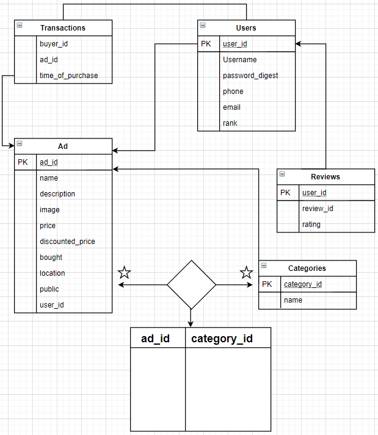
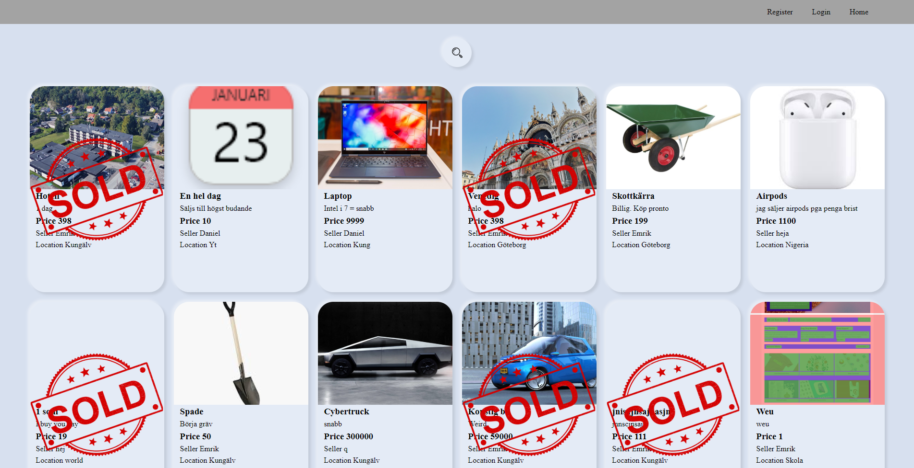

# Projektplan

## 1. Projektbeskrivning
* På sidan ska användare lägga upp annonser på varor som de säljer.
* De ska kunna kolla på specifika annonser samt ge säljaren ett betyg från 0 till 5
## 2. Vyer
__Skiss på landingpage__

__Skiss på en enstaka ad__

## 3. Databas med ER-diagram 

## 4. Arkitektur
__Mappar:__

public - Innehåller alla publika filer
* js 
* img - Innehåller en undermapp med alla annons bilder
  * ads_img
* css - Innehåller stilarket av sidan

views - Innehåller alla restful routes slim filer
* admin - Innehåller slim filer för admin relaterade händelser
* ads - Innehåller slim filer för annons relaterade händelser
* users - Innehåller slim filer för användar relaterade händelser

__Filer:__

app.rb - Huvuddelen i projektet där alla routes finns

model.rb - Inehåller alla databas förfrågningar + validering av information

## 5. Resultat

